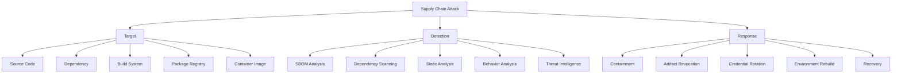
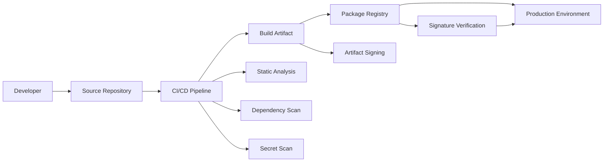
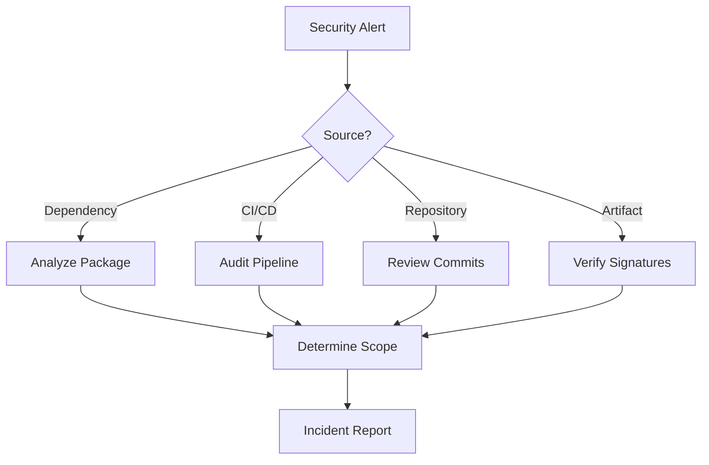

# [Supply Chain Attack](https://github.com/cybersecurity-dev/awesome-supply-chain-attack) Detection and Response [Analyst](https://github.com/cybersecurity-dev/awesome-supply-chain-attack-resources)'s Cookbook

 

    
    &nbsp;
    
    &nbsp;
    
    

> Software Supply Chain Security Pipeline

## 📖 Contents
- [Supply Chain Attack Detection and Response Steps](#supply-chain-attack-detection-and-response-steps)
- [My Other Awesome Lists](#my-other-awesome-lists)
- [Contributing](#contributing)
- [Contributors](#contributors)

## **Supply Chain Attack** Detection and Response Steps

> Supply Chain Attack Investigation

### `Phase 1`: Scope Identification

> You can access the `Scope Identification` phase page through this [link](./Cookbook/Scope%20Identification.md).

### `Phase 2`: Dependency Enumeration
> You can access the `Dependency Enumeration` phase page through this [link](./Cookbook/Dependency%20Enumeration.md).

### `Phase 3`: Package Reputation Analysis
> You can access the `Package Reputation Analysis` phase page through this [link](./Cookbook/Package%20Reputation%20Analysis.md).

### `Phase 4`: Source Code Review

### `Phase 5`: Detect Typosquatting

### `Phase 6`: Build System Analysis

### `Phase 7`: CI/CD Pipeline Assessment

### `Phase 8`: Artifact Verification

### `Phase 9`: Binary Analysis

### `Phase 10`: Container Analysis

### `Phase 11`: Secret and Credential Hunting

### `Phase 13`: SBOM Validation

### `Phase 14`: Vulnerability Correlation

### `Phase 15`: Threat Hunting Indicators

##

### My Other Awesome Lists
You can access the my other awesome lists [here](https://cyberthreatdefence.com/my_awesome_lists)

### Contributing
[Contributions of any kind welcome, just follow the guidelines](contributing.md)!

### Contributors
[Thanks goes to these contributors](https://github.com/cybersecurity-dev/Supply-Chain-Attack-Detection-Response-Analyst-Cookbook/graphs/contributors)!

[🔼 Back to top](#supply-chain-attack-detection-and-response-analysts-cookbook)
